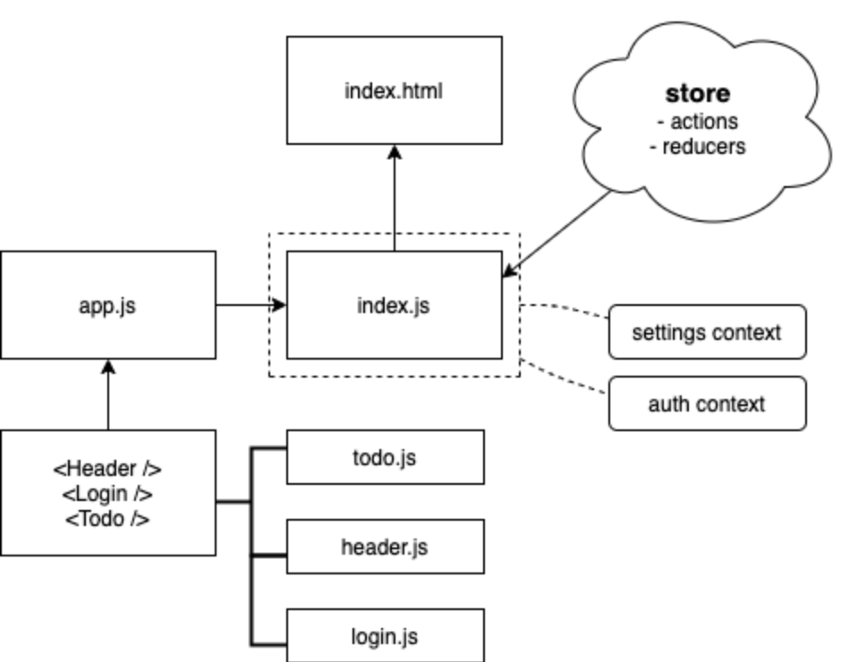

# Lab 36: To Do App: Redux

## Author: Natalie Alway

## Links and Resources
[Submission PR](https://github.com/nataliealway-401-advanced-javascript/lab-37-dynamic-forms/pull/1)  
[Travis CI](https://www.travis-ci.com/nataliealway-401-advanced-javascript/todo-app-redux)  
[Docs]()  
[Deployment](https://workingbranch.d3nicncj8hutq0.amplifyapp.com/)  

**CodeSandbox:**  
[ToDo App](https://codesandbox.io/s/todo-redux-z9ujp)  

## Solution

